# MyHealth AI — Database Entity Relationship Diagram (ERD)

> **Drift (SQLite) Schema Specification**  
> Supports offline-first clinical records, ML no-show predictions, and AI task workflows.

---

## 📊 Mermaid Entity Relationship Diagram

```mermaid
erDiagram
    Users ||--o| PatientProfiles : "has (1:1)"
    Users ||--o| StaffProfiles : "has (1:1)"
    Departments ||--o{ StaffProfiles : "employs (1:N)"
    Departments ||--o{ Appointments : "hosts (1:N)"
    Users ||--o{ Appointments : "patient (1:N)"
    Users ||--o{ Appointments : "doctor (1:N)"
    Users ||--o{ ScheduleTemplates : "doctor (1:N)"
    Appointments ||--o{ Reminders : "triggers (1:N)"
    Users ||--o{ MedicalRecords : "patient (1:N)"
    Users ||--o{ MedicalRecords : "author (1:N)"
    MedicalRecords ||--o{ LabValues : "contains (1:N)"
    Users ||--o{ Vitals : "patient (1:N)"
    Users ||--o{ Medications : "patient (1:N)"
    Users ||--o{ AiSummaries : "patient (1:N)"
    Users ||--o{ RiskFlags : "patient (1:N)"
    Users ||--o{ StaffTasks : "staff (1:N)"
    Users ||--o{ StaffTasks : "patient (1:N)"
    Users ||--o{ AuditLog : "actor (1:N)"

    Users {
        int id PK
        string role "patient | staff | admin"
        string fullName
        string email UK
        string passwordHash
        string passwordSalt
        string phone
        datetime dob
        string gender "M | F"
        string nationalId UK "CPR"
        bool isActive
        datetime createdAt
    }

    PatientProfiles {
        int userId PK, FK
        string bloodType
        string allergies
        string chronicConditions
        string emergencyContact
    }

    Departments {
        int id PK
        string name UK
        string description
    }

    StaffProfiles {
        int userId PK, FK
        int departmentId FK
        string specialty
        string licenseNo UK
        string jobTitle
    }

    Appointments {
        int id PK
        int patientId FK
        int staffId FK
        int departmentId FK
        datetime slotStart
        datetime slotEnd
        string visitType
        string status "booked | confirmed | completed | cancelled | noShow"
        string reasonText
        datetime bookedAt
        real noShowRisk "0.0 - 1.0 (RQ2)"
        string riskBand "low | medium | high"
        int remindersSent
        datetime checkedInAt
    }

    ScheduleTemplates {
        int id PK
        int staffId FK
        int weekday "1=Mon .. 7=Sun"
        string startTime "HH:mm"
        string endTime "HH:mm"
        int slotMinutes "Default 30"
    }

    Reminders {
        int id PK
        int appointmentId FK
        datetime scheduledFor
        string channel "pushNotification | sms | inAppBanner"
        datetime sentAt
        string kind "standard | escalated | confirmOrRelease"
    }

    MedicalRecords {
        int id PK
        int patientId FK
        int authorStaffId FK
        string recordType "visitNote | labResult | imaging | prescription | vaccination | dischargeSummary"
        string title
        string body
        datetime occurredAt
        string sourceFacility
        string attachmentPath
        string extractedText "RQ1 Text Extraction"
        datetime createdAt
    }

    LabValues {
        int id PK
        int recordId FK
        string analyte "e.g. HbA1c"
        real value
        string unit
        real refLow
        real refHigh
        bool abnormalFlag
    }

    Vitals {
        int id PK
        int patientId FK
        datetime recordedAt
        real systolic
        real diastolic
        real heartRate
        real tempC
        real weightKg
        real heightCm
        real spo2
        real glucose
    }

    Medications {
        int id PK
        int patientId FK
        int prescriberId FK
        string name
        string dose
        string frequency
        datetime startDate
        datetime endDate
        bool isActive
    }

    AiSummaries {
        int id PK
        int patientId FK
        datetime generatedAt
        string modelId "claude-3-5-sonnet | mock-ai"
        string promptVersion
        string summaryMarkdown
        string keyEventsJson
        string trendsJson
        string redFlagsJson
        string inputHash UK "Cache Key (RQ1)"
    }

    RiskFlags {
        int id PK
        int patientId FK
        string kind
        string severity "low | medium | high | critical"
        string rationale
        datetime detectedAt
        string source "deterministicRule | aiModel"
        int acknowledgedBy FK
        datetime acknowledgedAt
    }

    StaffTasks {
        int id PK
        int staffId FK
        int patientId FK
        string title
        string kind "reviewAbnormalLab | followUpOverdue | medicationRenewal"
        datetime dueAt
        string status "pending | inProgress | completed | dismissed"
        real ruleScore "0 - 100"
        real aiPriorityScore "0 - 100"
        string aiRationale "RQ3 Explainable Rationale"
        datetime createdAt
    }

    AuditLog {
        int id PK
        int actorUserId FK
        string action
        string entityType
        int entityId
        datetime timestamp
        string metadataJson
    }

    AppSettings {
        int id PK
        bool aiEnabled
        bool mockMode
        string modelId
        int seedVersion
        datetime lastSeededAt
    }
```

---

## 🎯 Research Questions Mapping in Database

1. **RQ1 (Unified Health Timeline & Summaries):**
   - Ingestion: `medical_records.extractedText` stores plain text parsed from uploaded PDF files.
   - Summarization: `ai_summaries` caches `{summaryMarkdown, keyEventsJson, trendsJson, redFlagsJson}` keyed on `inputHash` to prevent duplicate API costs.
2. **RQ2 (No-Show Prediction & Smart Scheduling):**
   - Prediction: `appointments.noShowRisk` and `appointments.riskBand` store offline ML probabilities.
   - Escalation: `reminders.kind` triggers risk-adaptive notifications.
3. **RQ3 (Clinical Task Prioritization & Risk Flags):**
   - Detection: `risk_flags` captures automated rule alerts.
   - Workflow: `staff_tasks.aiPriorityScore` and `staff_tasks.aiRationale` blend rule scores with LLM reasoning.
