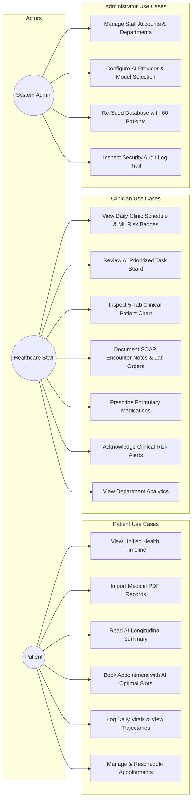
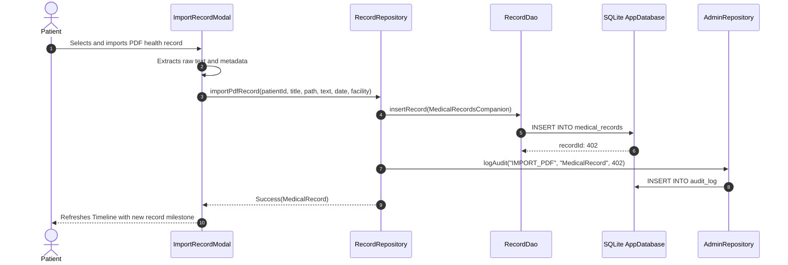
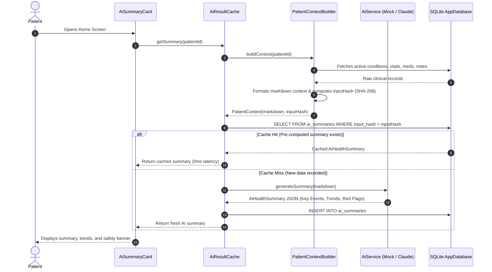
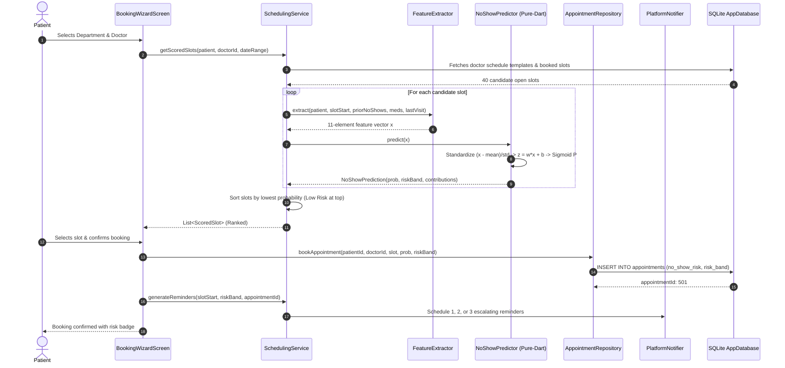
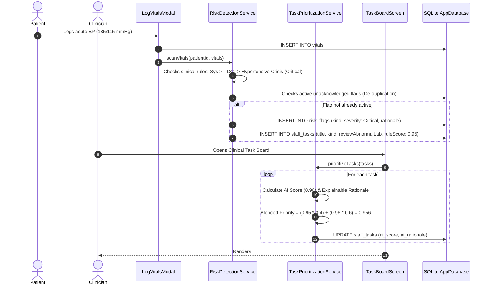

# System Architecture & UML Design Specifications — MyHealth AI

> **Senior Project Technical Documentation:** University of Bahrain — College of Information Technology  
> **Team:** Ali Mohamed Jaafar (202208244) & Mohammed A.Redha Meftah (202209027)  
> **Supervisor:** Dr. Amal Ghanim

---

## 1. System Architecture Overview

**MyHealth AI** is engineered as a high-performance, local-first medical intelligence platform. The architecture eliminates external server/cloud database dependencies by embedding a high-speed SQLite database on-device using Drift (with WebAssembly/OPFS support on the web) and executing a pure-Dart Machine Learning engine for sub-millisecond inference.

```mermaid
flowchart TD
    subgraph Presentation Layer [Presentation Layer (Flutter 3.44 / Riverpod)]
        PatientUI[Patient Shell & Timeline]
        StaffUI[Staff Shell & Patient Charts]
        AdminUI[Admin Console & Audit Trail]
        SharedUI[Design Tokens, DoubleBezelCard, ClinicalBadge]
    end

    subgraph State & Controller Layer [State & Business Logic Layer]
        AuthController[AuthController]
        NavState[Navigation Providers]
        TimelineState[Timeline & Record Streams]
        TaskState[Staff Task Providers]
    end

    subgraph Domain & Service Layer [Pure Domain & Service Layer (Pure Dart)]
        AuthRepo[Auth Repository Interface]
        RecordRepo[Record Repository Interface]
        SchedService[SchedulingService (RQ2)]
        MLPredictor[NoShowPredictor (Pure-Dart ML)]
        FeatureExtract[FeatureExtractor (11 Features)]
        RiskService[RiskDetectionService (RQ3)]
        TaskPrioritize[TaskPrioritizationService (RQ3)]
        ContextBuilder[PatientContextBuilder (RQ1)]
        AiCache[AiResultCache Proxy]
    end

    subgraph Dual AI Layer [Dual AI Infrastructure (RQ1 / RQ3)]
        MockAI[MockAiService (Offline Defense Insurance)]
        ClaudeAI[ClaudeAiService (Anthropic Messages API)]
    end

    subgraph Data & Storage Layer [Local-First Data Layer (Drift / SQLite)]
        AppDB[(AppDatabase SQLite)]
        UserDao[UserDao]
        RecordDao[RecordDao]
        AppointmentDao[AppointmentDao]
        TaskDao[TaskDao]
        SystemDao[SystemDao]
    end

    Presentation Layer --> State & Controller Layer
    State & Controller Layer --> Domain & Service Layer
    Domain & Service Layer --> Dual AI Layer
    Domain & Service Layer --> Data & Storage Layer
```

---

## 2. Comprehensive System Use-Case Diagram



---

## 3. Core Sequence Diagrams

### Sequence 1: Patient PDF Record Ingestion & Chronological Extraction (RQ1)



---

### Sequence 2: AI Summarization Context Budgeting & SQLite Caching (RQ1)



---

### Sequence 3: ML No-Show Prediction & Escalating Reminder Scheduling (RQ2)



---

### Sequence 4: Acute Vitals Threshold Breach $\rightarrow$ Alert De-duplication $\rightarrow$ AI Task Prioritization (RQ3)


